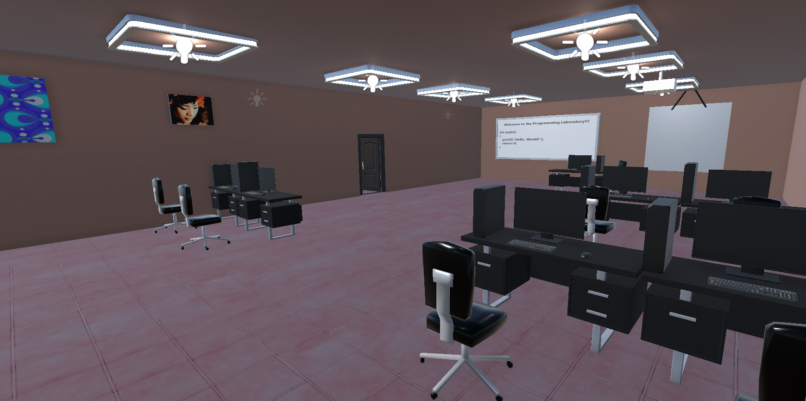
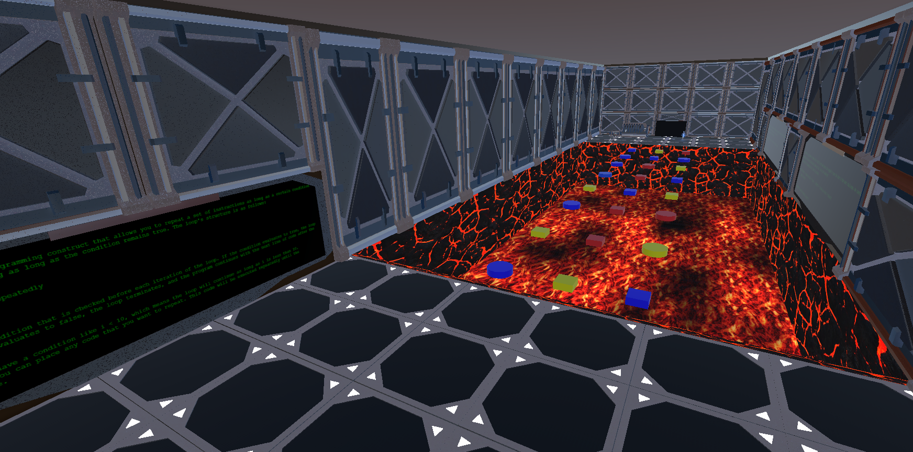
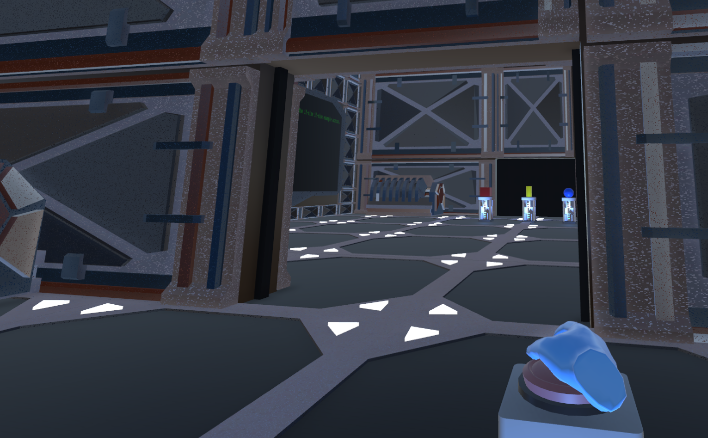
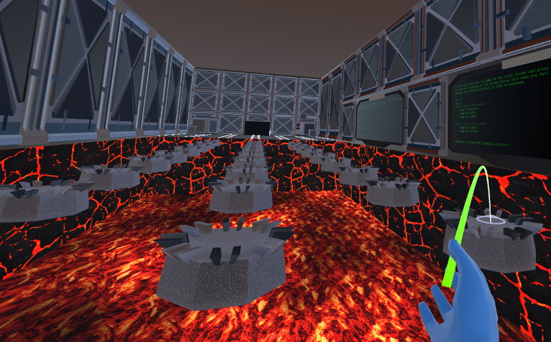
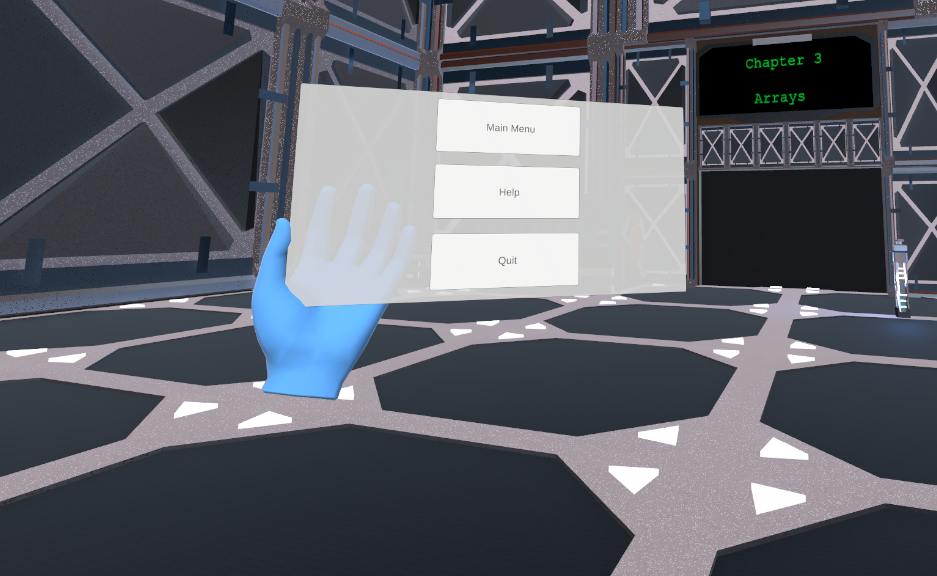

# CodeQuest: Escape the Lab
An Educational Virtual Reality Game for Learning Basic Programming Concepts in C

# Screenshots

# 📘 Overview
CodeQuest: Escape the Lab is a serious educational game developed as part of a Master's thesis at the University of West Attica (UniWA).
The project explores how Virtual Reality (VR) and gamification techniques can enhance the learning experience of programming, focusing on fundamental programming structures such as:

Selection structures (if, if-else)

Iteration (for, while)

Arrays (1D & 2D)

Through immersive 3D interactions, players solve puzzles that require applying these concepts to progress and “escape” from a virtual laboratory.

# 🎯 Purpose and Research Context
The project aims to evaluate the effectiveness of VR-based learning environments in improving programming comprehension and engagement compared to traditional teaching methods.
The study includes a pre- and post-test experimental design and a user feedback questionnaire assessing usability, engagement, and perceived learning outcomes.

# Youtube Footage
https://youtu.be/G_UhG3R11BU

# 🛠️ Technologies Used
Engine: Unity 3D

Language: C#

Platform: VR 

Development Environment: Unity Editor 2022.x

VR SDK: Oculus Integration / XR Interaction Toolkit

# 🧩 How to Run

Open the project in Unity 2022.x.

Connect a VR headset or use Unity XR simulator.

Press Play to start the main scene (MainMenu or Level1).

# Author

Tsaousis Panagiotis
Master’s Thesis — University of West Attica (UniWA)
Supervisor: Voyiatzis Ioannis
Email: panagiotisklmt34@gmail.com

# 📚 Citation

If you use this project or reference it in academic work, please cite as:

Tsaousis Panagiotis, T.P. (2025). "Virtual reality and Programming Learning: Development and Experimental Evaluation of an Educational Serious Game" Master’s Thesis, University of West Attica.

# External Ressources
This project uses a combination of these assets and tutorials :

https://youtu.be/6OT43pvUyfY

https://youtu.be/JCyJ26cIM0Y

https://github.com/Unity-Technologies/XR-Interaction-Toolkit-Examples

